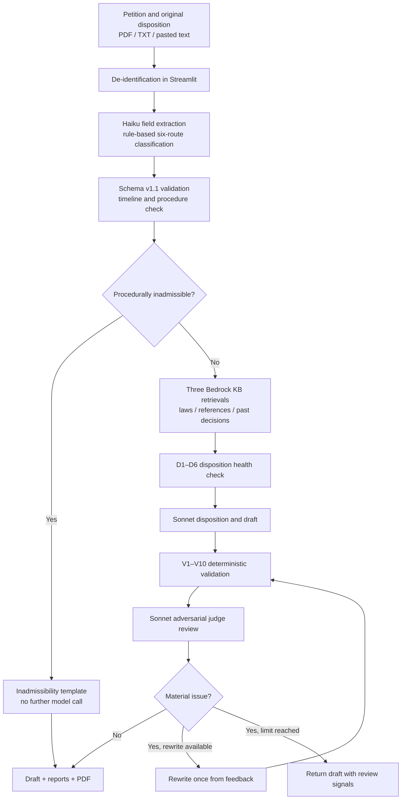

# NTPC AI-Assisted Administrative Appeal Review Workbench

Language / 語言: **English** | [繁體中文](README.md)

This project is an administrative-appeal review prototype built for the **2026 NTPC Hackathon**. It transforms petitions and original administrative dispositions into structured case data, retrieves relevant laws and historical decisions, drafts appeal decisions, and evaluates the output with deterministic rules and an adversarial legal review.

Its core principle is: **review before drafting; keep deterministic checks out of the model; make legal citations traceable to retrieved sources**.

> **Usage and safety boundary:** This is a hackathon prototype and may process only fictitious or properly de-identified data. Its outputs are drafts for authorized legal review; it **does not issue final decisions or replace professional legal judgment**.

[Demo at a glance](#demo-at-a-glance) · [Problem and value](#problem-and-value) · [Capabilities](#key-capabilities) · [Workflow](#runtime-workflow) · [3-minute demo](#3-minute-demo) · [Quick start](#quick-start) · [Safety](#data-security-and-competition-constraints) · [Limitations](#known-limitations)

## Demo at a glance

| Item | What the demo shows |
|---|---|
| Main entry point | A two-stage Streamlit workbench: case intake and analysis → appeal-decision draft |
| Input | A required petition and recommended original disposition; PDF, TXT, and pasted petition text are supported |
| Analysis | Six-route classification, structured fields, procedure result, recommended laws, similar decisions, and D1–D6 findings |
| Draft result | Disposition, facts and reasoning, remedy notice, V1–V10 report, critic findings, and human-review signals |
| Deliverable | Government-document-style preview and downloadable PDF |
| Checks run for this revision | `compileall`, core dry-run, preflight, `pip check`, and README link checks passed; no live AWS probe was run |
| Maturity | The Streamlit mainline is demonstrable; Lambda, Step Functions, and the S3 event path are not yet end-to-end equivalent |

## Problem and value

| Review task | Conventional risk | How this system assists |
|---|---|---|
| Read multiple long case documents | Facts, claims, and dates are distributed and easy to miss | Extract dispositions, dates, authorities, requests, claims, and evidence into a schema v1.1 case payload |
| Verify procedure and deadlines | Late filing, service, or penalty-limitation issues may be overlooked | Build a deterministic timeline and run procedure and objective defect checks before drafting |
| Research authorities and precedent | Search results can become disconnected from citations in the draft | Retrieve laws, interpretations/judgments, and historical decisions through Bedrock KB to form an allowed source set |
| Draft and review reasoning | A model may invent citations, omit claims, or make unsupported logical jumps | Use V1–V10 for objective failures, a critic for legal reasoning, and at most one bounded rewrite |
| Deliver and audit work | Draft quality signals may be opaque | Return the draft, validation result, human-review signal, and PDF together |

## Key capabilities

| Capability | Current implementation | Visible demo output |
|---|---|---|
| Document input | Streamlit accepts petition and original-disposition PDF/TXT files, with direct petition text as an alternative | Upload state and the two-stage review flow |
| Case structuring | Claude Haiku 4.5 extracts parties, dispositions, dates, legal bases, requests, claims, and evidence | Case route, procedure status, and retrieval context |
| Six-route classification | Money laundering, waste disposal, air pollution, building, noise control, and a general fallback route | Classified case-type card |
| Procedural and defect checks | Pure Python builds the timeline, detects selected inadmissibility grounds, and runs D1–D6 objective defect checks | Inadmissibility notice or a reference direction for merits review |
| RAG | Amazon Bedrock Knowledge Bases retrieves statutes, interpretations/judgments, and historical appeal decisions in separate batches | Recommended authorities and expandable similar decisions |
| Decision drafting | Claude Sonnet 4.5 uses facts, permitted authorities, similar cases, and defect findings to draft the disposition and reasoning | Disposition, reasoning paragraphs, and remedy notice |
| Two-layer quality control | V1–V10 checks objective errors; Sonnet reviews legal subsumption and reasoning quality from a judge's perspective | Specific review reasons when blocking rule failures remain |
| Bounded correction | A blocking failure or material critic finding can trigger at most one automatic rewrite and another review | Revised draft and quality flags |
| Output | The UI presents the final draft and review signal | Document-style preview and PDF download |
| Legal research helper | A separate law/case retrieval and summarization mode outside the formal drafting workflow | Markdown research summary |

## Runtime workflow



This is a **deterministic, orchestrated workflow**, not an autonomous agent. The project does not use Bedrock Agents or `InvokeAgent`. Case-specific behavior comes from `CASE_PROFILES` in `core/draft.py`, which switches prompts and review priorities by `route_key` while keeping execution steps, request pacing, and citation sources controllable.

## 3-minute demo

After installing dependencies, the interface and control flow can be exercised with fictitious data and no AWS permissions:

1. Set `BEDROCK_DRY_RUN=1` in `.env`.
2. Run `python -m streamlit run app/streamlit_app.py`.
3. Upload `data/samples/訴願書_範例.pdf` and `data/samples/原處分書_範例.pdf`.
4. In stage one, inspect the route, recommended-law, and similar-case sections. In stage two, generate and download the PDF draft.

Dry-run uses mock model and KB responses. It verifies wiring, not legal quality. The mock draft may trigger a V4 human-review signal because it does not answer the sample claims; that result demonstrates that the deterministic validator is active. Use the live AWS path below to demonstrate real retrieval and drafting.

## Architecture and maturity

Business-facing data contracts live in `core/` and primarily use **dict-in/dict-out** interfaces, allowing multiple shells to reuse the same workflow. The package still contains necessary side effects such as AWS calls, cache writes, and environment loading; “shared core” means environment-agnostic business contracts, not that every function is mathematically pure.

| Component | Role | Current status |
|---|---|---|
| `app/streamlit_app.py` | Main hackathon demo | Most complete path: uploads, de-identification, two-stage review, draft preview, and PDF download |
| `core/` | Shared analysis, retrieval, drafting, and validation | Executable; supports raw-text and schema v1.1 payload entry points |
| `pipeline/` | Historical-data parsing and KB-source preparation | `kb_ingest_s3.py` is the recommended de-identifying conversion path |
| `lambda_handlers/` | Thin AWS Lambda shells | Architecture prototype; not yet behaviorally equivalent to the Streamlit path |
| `stepfunctions/` | Target cloud orchestration design | ASL exists, but the current data contract and inadmissible output path are not fully connected |
| S3 event trigger | Start the state machine from an uploaded JSON object | Handler exists; complete deployment, idempotency, and privacy gating remain open |
| `henry/` | Admissibility and local-vector-RAG experiments | Independent prototype, not connected to the Streamlit mainline |

The accurate project status is: **a demonstrable Streamlit prototype for AI-assisted administrative appeal review; cloud shells and production deployment remain prototype work.**

## Rules versus models

| Layer | Main modules | Responsibility | Logical Bedrock operations |
|---|---|---|---:|
| Extraction | `extract.py` | Convert free text into schema fields | 1 Haiku call |
| Rules | `classify.py`, `timeline.py`, `procedure.py`, `defects.py` | Classification, dates, deadlines, admissibility, and D1–D6 | 0 |
| Retrieval | `kb.py`, `recommend_laws.py`, `similar_cases.py` | Laws, interpretations/judgments, and past decisions | Baseline: 3 Retrieve calls |
| Drafting | `draft.py` | Produce the disposition, reasoning, and remedy notice | 1 Sonnet call |
| Objective validation | `verify.py` | V1–V10 citation, article, claim, date, and consistency checks | 0 |
| Legal quality | `critic.py` | Subsumption gaps, weak responses, omitted issues, and revocation risk | 1 Sonnet call |
| Correction | `pipeline.py` | Rewrite and review once when material issues remain | Up to 2 additional Sonnet calls |

With a cache miss and no retry, KB fallback, or request-shape probe, a normal structured-payload case has a baseline of 5 logical operations, or 7 with a rewrite. Starting from raw Streamlit documents adds extraction, resulting in 6 or 8 operations. Cache hits may reduce actual network requests; retries, filter fallback, and KB search-shape probing may increase them.

## AWS services and models

The default AWS Region is `us-west-2`.

| Service/model | Purpose |
|---|---|
| Claude Haiku 4.5 | Field extraction and lightweight synthesis in the legal research helper |
| Claude Sonnet 4.5 | Drafting, adversarial review, and an optional rewrite |
| Cohere Embed Multilingual v3 | Bedrock Knowledge Base embeddings |
| Amazon Nova Lite | Used only by the independent `henry/` admissibility experiment, not the Streamlit mainline |
| Amazon S3 | Knowledge Base source and JSON input/output for cloud shells |
| Bedrock Knowledge Bases | Managed vectorization, indexing, and Retrieve API |

Claude Sonnet 4.5 and Haiku 4.5 use inference profile IDs with the `us.` prefix. Callers use the project facade `BedrockClient.converse()`; under the hood it calls `bedrock-runtime.invoke_model()` to match the hackathon account permissions.

### Bedrock request rate: no more than 1 RPS

`core/bedrock_client.py` provides the shared throttle gate:

1. A `threading.Lock` serializes threads in one Python process.
2. An atomic lock directory plus a timestamp coordinates Python processes on the same machine.
3. The default minimum interval is 1.05 seconds, leaving a safety margin.
4. KB Retrieve and direct model calls in `henry/` invoke the same `throttle()` before their requests.

This coordinates processes on **one machine**. Separate Lambda execution environments do not share their local lock state, so the current Step Functions prototype must not be treated as proof of account-wide 1 RPS enforcement across parallel executions.

## Quick start

### Prerequisites

- Python 3.10 or newer
- macOS, Linux, or Windows
- For live AWS mode: AWS CLI, a valid standard credential chain, and permissions for Bedrock and the configured Knowledge Base

### Install

```bash
git clone https://github.com/jsyang0322/2026_NTPC_hackathon.git
cd 2026_NTPC_hackathon
python -m venv .venv

# macOS / Linux
source .venv/bin/activate

# Windows PowerShell
# .venv\Scripts\Activate.ps1

python -m pip install -r requirements.txt
cp .env.example .env
```

Importing `core` loads the repository-root `.env` through `python-dotenv` without overriding variables already defined in the shell. Do not place AWS access keys in `.env`; use the standard AWS CLI/SDK credential chain.

### Offline smoke test

```bash
python -m core.pipeline --dry-run
```

This runs the built-in schema v1.1 example through the core wiring and fallbacks without contacting Bedrock or the Knowledge Base. It is not a legal-quality test and does not start Streamlit.

To inspect the UI offline, set the following in `.env`:

```dotenv
BEDROCK_DRY_RUN=1
```

Then run:

```bash
python -m streamlit run app/streamlit_app.py
```

### Live AWS demo

1. Complete `.env`, including `AWS_REGION`, `BEDROCK_KB_ID`, both Claude inference profiles, and `BEDROCK_DRY_RUN=0`.
2. Confirm the active AWS identity.
3. Run preflight. Add `--probe` only when a real AWS request is intended.
4. Start Streamlit.

```bash
aws sts get-caller-identity
python -m scripts.preflight_check
# python -m scripts.preflight_check --probe  # sends real KB and Bedrock requests
python -m streamlit run app/streamlit_app.py
```

On macOS/Linux, `./run.sh` is also available; on Windows PowerShell, use `.\run.ps1`. Both wrappers run preflight before starting Streamlit.

> **Important:** When no Knowledge Base ID is configured, `core.kb.retrieve()` returns a mock hit even if `BEDROCK_DRY_RUN=0`. Claude may therefore be live while the RAG context is not. Always run preflight and confirm the KB configuration before a live demo.

### Sample documents

`data/samples/` contains fictitious petition and original-disposition TXT/PDF files that can be uploaded directly to Streamlit. They intentionally include simulated names, addresses, phone numbers, and an ID-like value to exercise de-identification. This does not imply that the masker covers every category or format of real personal data.

## Main environment variables

| Variable | Default/purpose |
|---|---|
| `AWS_REGION` | `us-west-2` |
| `BEDROCK_MODEL_WRITER` | Claude Sonnet 4.5 inference profile |
| `BEDROCK_MODEL_LIGHT` | Claude Haiku 4.5 inference profile |
| `BEDROCK_KB_ID` | Shared Knowledge Base ID; required for live RAG |
| `BEDROCK_KB_SEARCH_MODE` | `auto`, `managed`, or `vector` |
| `BEDROCK_KB_FILTER_FALLBACK` | Retry without metadata filters when filtered retrieval is empty; default `1` |
| `BEDROCK_KB_QUERY_MAX_CHARS` | KB query length cap; code default is 500 |
| `BEDROCK_MIN_INTERVAL` | Shared minimum interval between Bedrock requests; default 1.05 seconds |
| `BEDROCK_RATE_STATE` | Custom path for the cross-process throttle lock and timestamp |
| `BEDROCK_DRY_RUN` | `1` disables live LLM and KB requests |
| `BEDROCK_NO_CACHE` | `1` disables the LLM response cache |
| `BEDROCK_EMBED_MODEL` | Embedding model used for KB setup and `henry/` experiments |

See [`.env.example`](.env.example) for complete examples and model IDs.

## Knowledge Base data preparation

The recommended path is `pipeline/kb_ingest_s3.py`, which converts source JSON documents into Bedrock KB-compatible `.txt` and `.txt.metadata.json` files. It writes metadata such as `case_type`, `doc_type`, `year`, and `disposition`, and performs rule-based de-identification before writing content.

First inspect a small conversion **without uploading**:

```bash
python -m pipeline.kb_ingest_s3 \
  --routes money_laundering,waste,air_pollution \
  --limit 3 \
  --print-sample \
  --upload ""
```

Upload only after reviewing the masking, metadata, and destination bucket:

```bash
python -m pipeline.kb_ingest_s3 \
  --routes money_laundering,waste,air_pollution \
  --account <AWS_ACCOUNT_ID> \
  --upload s3://<PRIVATE_KB_SOURCE_BUCKET>/kb-source/
```

After conversion, the Bedrock Knowledge Base data source and ingestion job must still be configured and started in AWS. This repository currently has no IaC or automation that creates the Knowledge Base or starts ingestion.

> `pipeline/kb_ingest.py` is an older local PDF converter and does not provide the same de-identification gate. **Do not use it to upload raw documents containing personal data to AWS.**

## Repository structure

```text
2026_NTPC_hackathon/
├── app/
│   └── streamlit_app.py       # Demo UI, de-identification call, preview, and PDF download
├── core/
│   ├── bedrock_client.py      # Shared client, ≤1 RPS gate, cache, and retry
│   ├── schemas.py             # Schema v1.1 and six route keys
│   ├── classify.py            # Rule-based case classification
│   ├── extract.py             # Haiku structured extraction
│   ├── timeline.py            # ROC/Gregorian date and deadline timeline
│   ├── procedure.py           # Procedural inadmissibility rules
│   ├── defects.py             # D1–D6 original-disposition checks
│   ├── kb.py                  # Bedrock KB Retrieve and metadata filters
│   ├── recommend_laws.py      # Law, interpretation, and judgment recommendations
│   ├── similar_cases.py       # Shared pool of past decisions with route weighting
│   ├── draft.py               # CASE_PROFILES and Sonnet drafting
│   ├── verify.py              # V1–V10 deterministic validation
│   ├── critic.py              # Adversarial judge review
│   ├── law_lookup.py          # Separate legal research helper
│   └── pipeline.py            # Intake, analysis, draft, and rewrite orchestration
├── pipeline/
│   ├── parse.py               # Historical PDF parsing and section splitting
│   ├── analyze.py             # Counts by volume, case type, and year
│   ├── kb_ingest.py           # Legacy local KB conversion tool
│   └── kb_ingest_s3.py        # Recommended S3 JSON-to-KB source and de-identification path
├── lambda_handlers/           # Lambda shells and S3 trigger prototype
├── stepfunctions/             # ASL and manual deployment notes; not a complete deployment
├── henry/                     # Independent admissibility/local-vector-RAG experiments
├── scripts/
│   ├── preflight_check.py     # KB, dry-run, cache, and optional live probe checks
│   └── txt_to_pdf.py          # Convert Chinese sample TXT files to PDF
├── data/
│   └── samples/               # Fictitious cases; raw/cache runtime data is not tracked
├── .kiro/                     # Specs, steering, hooks, and MCP settings
├── run.sh / run.ps1           # Streamlit startup and preflight wrappers
├── requirements.txt
└── .env.example
```

## Input contract

The two halves of the workflow exchange schema v1.1 payloads defined in `core/schemas.py`. The six valid route keys are:

```python
("money_laundering", "waste", "air_pollution", "building", "noise", "general")
```

Main entry points:

- `intake(case_text)`: raw document text to a schema v1.1 payload.
- `analyze_case(payload)`: procedure checks, KB retrieval, defect checks, and a reference direction.
- `generate_case_draft(analysis)`: drafting, V1–V10, critic review, and at most one rewrite.
- `process_from_text(case_text)`: end-to-end core entry point for raw text.
- `process_case(payload)`: end-to-end core entry point for a structured payload.

Callers that invoke raw-text core entry points directly must de-identify content first. This step is explicitly performed only by the Streamlit shell and the newer KB-ingest path today.

## Data, security, and competition constraints

- **Real personal data must not be imported into the AWS account.** `.gitignore` excludes `data/raw/`, `data/parsed/`, `data/cache/`, `data/kb_source/`, and `.env`.
- Streamlit and `pipeline/kb_ingest_s3.py` mask ROC ID numbers, addresses, mobile numbers, and names in selected document headers. This is best-effort rule-based masking, not complete DLP; suspected residual identifiers still require manual review.
- S3 buckets must remain private with all four Block Public Access settings enabled. The ingest utility converts and syncs data but does not create or verify this configuration for every destination bucket.
- AWS credentials use the standard credential chain and must not be committed or stored in `.env`.
- Core LLM calls, KB Retrieve, and direct model calls in Henry share the same Bedrock throttle entry point.
- `.kiro/` remains at the repository root to preserve specs, steering, hooks, and architecture decisions.

## Validation and development

The repository does not currently contain a formal `tests/` directory, pytest regression suite, or CI workflow. Available local checks are:

```bash
# Python syntax/import compilation
python -m compileall -q core app lambda_handlers pipeline henry scripts

# Offline core wiring
python -m core.pipeline --dry-run

# Environment and KB safeguards (no live probe by default)
python -m scripts.preflight_check

# Installed dependency consistency
python -m pip check
```

`python -m scripts.preflight_check --probe` sends real AWS requests. Use it only after configuring the intended account, models, permissions, and Knowledge Base.

## Known limitations

1. Streamlit is the only complete demo path. The Lambda/Step Functions shells do not yet provide equivalent rewrite behavior, result contracts, or distributed throttling.
2. De-identification is not yet a core invariant; callers that bypass Streamlit must mask data and check for residual identifiers first.
3. The timeline handles substituted service and weekend adjustment, but no public-holiday calendar is built in.
4. The V5 legal-version interface exists, but the mainline does not supply a version database, so it is currently skipped.
5. The legal research helper may synthesize from model knowledge and does not apply the formal drafting path's complete citation allowlist validation. Treat it as research assistance only.
6. A missing Knowledge Base ID silently degrades to a mock hit; preflight is mandatory before a live demo.
7. Real KB quality, model access, IAM, S3 policies, and ingestion state must be verified in the target AWS account.
8. This is a hackathon prototype. Every draft requires review by an authorized person before issuance or external use.

## Further documentation

- [`PROJECT_DEVELOPMENT_REPORT.md`](PROJECT_DEVELOPMENT_REPORT.md): development history, architecture, risks, and maturity assessment.
- [`CONTRIBUTING.md`](CONTRIBUTING.md): contribution and development conventions.
- [`stepfunctions/README.md`](stepfunctions/README.md): cloud orchestration design and current prototype status.
- [`henry/README.md`](henry/README.md): independent admissibility experiment instructions.
- [`.kiro/specs/draft-and-verify/`](.kiro/specs/draft-and-verify/): requirements, design, and task records.
