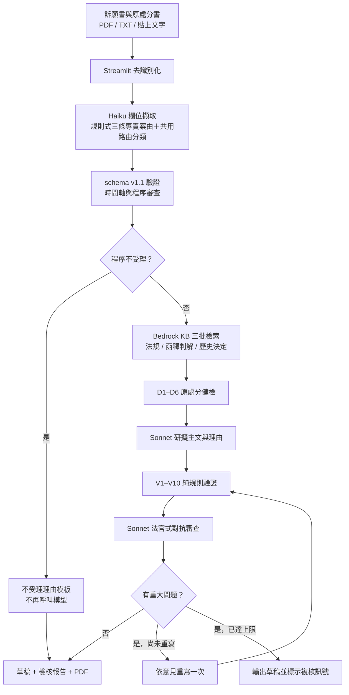

# 新北市政府訴願審議 AI 輔助工作台

Language / 語言：**繁體中文** | [English](README.en.md)

本專案是為 **2026 NTPC Hackathon** 建置的訴願審理輔助原型：將訴願書與原處分書轉成結構化案件資料，檢索相關法規與歷史決定，產生訴願決定書草稿，並以純規則與對抗式審查檢查輸出品質。

核心原則是 **先審查、後撰稿；能由規則判定的問題不交給模型；所有法律引用都應可追溯到檢索結果**。

> **使用與安全邊界：** 本系統是競賽原型，只能處理虛構或已完成去識別化的資料。輸出僅供法制人員複核，**不是自動核發決定書的系統，也不取代法律專業判斷**。

[Demo 摘要](#demo-摘要) · [問題與價值](#問題與價值) · [核心能力](#核心能力) · [工作流](#實際工作流) · [3 分鐘 Demo](#3-分鐘-demo) · [快速開始](#快速開始) · [安全限制](#資料安全與競賽限制)

## Demo 摘要

| 項目 | 可展示內容 |
|---|---|
| 主要入口 | Streamlit 二階段工作台：案件受理與分析 → 決定書草稿 |
| 輸入 | 訴願書必填；原處分書建議提供；支援 PDF、TXT 與貼上文字 |
| 分析結果 | 三條專責案由＋共用路由分類、結構化欄位、程序判定、推薦法規、相似歷史案例與 D1–D6 健檢 |
| 草稿結果 | 主文、事實及理由、救濟教示、V1–V10 報告、critic 意見與人工複核訊號 |
| 可交付輸出 | 公文風格預覽與 PDF 下載 |
| 本次文件驗證 | `compileall`、core dry-run、preflight、`pip check` 與 README 連結檢查均通過；未執行 live AWS probe |
| 成熟度 | Streamlit 主線可展示；Lambda／Step Functions／S3 event 為尚未端到端等價的雲端原型 |

## 問題與價值

| 審理工作 | 傳統風險 | 本系統的輔助方式 |
|---|---|---|
| 閱讀多份長篇案卷 | 欄位分散、爭點與日期容易遺漏 | 擷取處分、日期、法源、請求、主張與證據，形成 schema v1.1 案件資料 |
| 程序與期限核對 | 逾期、送達或裁處權時效可能漏審 | 以純規則建立時間軸，先做程序審查與客觀瑕疵健檢 |
| 查找法規與先例 | 搜尋結果與草稿引用來源難以對照 | 以 Bedrock KB 檢索法規、函釋／判解及歷史決定，建立可引用清單 |
| 撰寫與覆核理由 | 模型可能捏造引用、漏答主張或產生論理跳躍 | V1–V10 擋客觀錯誤，critic 檢查法律論證，必要時最多重寫一次 |
| 交付與抽查 | 草稿品質訊號不透明 | 同時輸出草稿、檢核結果、人工複核旗標與 PDF |

## 核心能力

| 能力 | 現行實作 | Demo 可見輸出 |
|---|---|---|
| 文件輸入 | Streamlit 支援訴願書與原處分書 PDF／TXT 上傳，也可直接貼上訴願內容 | 上傳狀態與二階段審理流程 |
| 案件結構化 | Claude Haiku 4.5 擷取當事人、處分、日期、法源、請求、主張與證據等欄位 | 案由、程序狀態與後續檢索上下文 |
| 三條專責案由＋共用路由 | 洗錢防制、廢棄物、空氣污染及通用案由 | 案由分類卡片 |
| 程序與原處分健檢 | 純 Python 建立時間軸、判斷部分不受理事由，並執行 D1–D6 客觀瑕疵檢查 | 不受理提示或實體審查參考方向 |
| RAG | 透過 Amazon Bedrock Knowledge Bases 分批檢索法規、函釋／判解與歷史決定書 | 推薦法規與可展開的相似決定 |
| 決定書草稿 | Claude Sonnet 4.5 依案件事實、可引用法源、相似案例與健檢結果研擬主文及理由 | 主文、理由段落與救濟教示 |
| 雙層品質檢查 | V1–V10 純規則驗證客觀錯誤；Sonnet 以法官視角檢查涵攝與論理弱點 | 規則紅燈未解時顯示具體複核原因 |
| 有限修正 | 發現規則紅燈或重大審查意見時，最多自動重寫一次，再重新驗證與審查 | 修正後草稿與品質旗標 |
| 輸出 | 顯示最終草稿與人工複核訊號 | 公文式預覽及 PDF 下載 |
| 法律小幫手 | 獨立進行法規／案例查詢與摘要，不進入正式草稿流程 | Markdown 法律查詢摘要 |

## 實際工作流



這是一條**固定編排的 workflow**，不是自主 Agent。專案不使用 Bedrock Agents 或 `InvokeAgent`；不同案由的專責效果由 `core/draft.py` 的 `CASE_PROFILES` 切換 prompt 與審查重點，以維持步驟、速率及引用來源的可控制性。

## 3 分鐘 Demo

完成依賴安裝後，可先用虛構資料驗證介面與控制流，不需 AWS 權限：

1. 在 `.env` 設定 `BEDROCK_DRY_RUN=1`。
2. 執行 `python -m streamlit run app/streamlit_app.py`。
3. 上傳 `data/samples/訴願書_範例.pdf` 與 `data/samples/原處分書_範例.pdf`。
4. 第一階段確認案由、推薦法規與相似案例區塊；第二階段生成草稿並下載 PDF。

Dry-run 使用 mock 模型與 KB，目的是確認串接，不代表法律品質。Mock 草稿可能因未回應示範主張而觸發 V4 人工複核訊號，這表示規則檢查確實運作；要展示真實 RAG 與草稿品質，請改用下方的真實 AWS 流程。

## 架構與完成度

業務資料介面集中在 `core/`，主要採 **dict 進、dict 出**，讓不同外殼可以重用相同流程。`core/` 仍包含 AWS 呼叫、快取與環境載入等必要副作用，因此這裡的「共用核心」是指不綁 Streamlit／Lambda 的業務契約，而不是所有函式皆為無副作用純函式。

| 元件 | 定位 | 現況 |
|---|---|---|
| `app/streamlit_app.py` | 競賽 Demo 主線 | 最完整；具備上傳、去識別化、二階段審理、草稿預覽與 PDF 下載 |
| `core/` | 共用案件分析、檢索、撰稿與檢核 | 可執行；提供原始文字與 schema v1.1 payload 入口 |
| `pipeline/` | 歷史資料解析與 KB source 前處理 | `kb_ingest_s3.py` 為目前建議的去識別化轉檔路徑 |
| `lambda_handlers/` | AWS Lambda 薄外殼 | 架構原型；尚未完全等價重用 Streamlit 主線 |
| `stepfunctions/` | Step Functions 正式架構示意 | ASL 已存在，但目前資料契約與不受理輸出仍未完整串通 |
| S3 event trigger | 上傳 JSON 後啟動狀態機 | handler 已存在；仍缺完整部署、冪等與隱私閘門 |
| `henry/` | 受理判定與本地向量 RAG 實驗 | 獨立原型，未接入 Streamlit 主線 |

目前可合理定位為：**可展示的 Streamlit AI 輔助訴願審理原型；雲端外殼與正式部署仍在原型階段。**

## 規則與模型分工

| 層次 | 主要模組 | 責任 | Bedrock 邏輯呼叫 |
|---|---|---|---:|
| 擷取 | `extract.py` | 將自由文字轉成 schema 欄位 | 1 次 Haiku |
| 規則 | `classify.py`、`timeline.py`、`procedure.py`、`defects.py` | 分類、日期、期限、受理與 D1–D6 | 0 |
| 檢索 | `kb.py`、`recommend_laws.py`、`similar_cases.py` | 法規、函釋／判解、歷史案例 | 基準 3 次 Retrieve |
| 撰稿 | `draft.py` | 產生主文、理由與救濟教示 | 1 次 Sonnet |
| 客觀驗證 | `verify.py` | V1–V10 引用、條號、主張、日期、主文一致性等 | 0 |
| 法律品質 | `critic.py` | 涵攝跳躍、回應強度、漏審與撤銷風險 | 1 次 Sonnet |
| 修正 | `pipeline.py` | 有重大問題時重寫並重審，最多一次 | 最多再 2 次 Sonnet |

在 cache miss、無 retry、無 KB fallback／request-shape 探測時，已結構化 payload 的一般案件基準為 5 次邏輯操作，觸發重寫為 7 次；從 Streamlit 原始文件進入時，欄位擷取使其成為 6／8 次。快取可能減少真實網路請求；retry、filter fallback 或 KB search shape 探測則可能增加請求。

## AWS 與模型

專案預設部署區域為 `us-west-2`。

| 服務／模型 | 用途 |
|---|---|
| Claude Haiku 4.5 | 欄位擷取與法律小幫手的輕量綜合 |
| Claude Sonnet 4.5 | 草稿、對抗式審查及必要重寫 |
| Cohere Embed Multilingual v3 | Bedrock Knowledge Base 向量化 |
| Amazon Nova Lite | 僅供 `henry/` 的獨立受理判定實驗，不在 Streamlit 主線 |
| Amazon S3 | Knowledge Base source 與雲端外殼的 JSON 輸入／輸出 |
| Bedrock Knowledge Bases | 託管向量化、索引與 Retrieve API |

Claude Sonnet 4.5 與 Haiku 4.5 使用 `us.` 前綴的 inference profile ID。專案對外統一呼叫 `BedrockClient.converse()`，其底層因競賽帳號權限而使用 `bedrock-runtime.invoke_model()`。

### Bedrock ≤ 1 RPS

`core/bedrock_client.py` 提供共用節流閘門：

1. `threading.Lock` 序列化同一 Python 行程中的執行緒。
2. 原子檔案鎖目錄與 timestamp 協調同一台機器上的多個 Python 行程。
3. 預設最小間隔為 1.05 秒，保留速率安全邊際。
4. KB Retrieve 與 `henry/` 的直接 `invoke_model` 也在呼叫前使用同一個 `throttle()`。

這套機制能協調**同一台機器**上的行程，但不同 Lambda execution environment 不共享本機鎖；因此目前的 Step Functions 原型不可用來宣稱多個平行 execution 仍具帳號層級全域 1 RPS 保證。

## 快速開始

### 需求

- Python 3.10 以上
- macOS、Linux 或 Windows
- 真實 AWS 模式另需 AWS CLI、有效的標準 credential chain，以及 Bedrock／Knowledge Base 權限

### 安裝

```bash
git clone https://github.com/jsyang0322/2026_NTPC_hackathon.git
cd 2026_NTPC_hackathon
python -m venv .venv

# macOS / Linux
source .venv/bin/activate

# Windows PowerShell
# .venv\Scripts\Activate.ps1

python -m pip install -r requirements.txt
cp .env.example .env
```

`core` 會透過 `python-dotenv` 自動載入 repo 根目錄的 `.env`，且不覆寫 shell 已存在的環境變數。AWS Access Key 不應放進 `.env`；請使用 AWS CLI／SDK 的標準 credential chain。

### 離線 smoke test

```bash
python -m core.pipeline --dry-run
```

這個命令使用內建 schema v1.1 示範案件，驗證 core 的串接與 fallback，不呼叫真實 Bedrock／KB。它不是法律品質測試，也不會啟動 Streamlit。

若要以離線模式檢視 UI，先在 `.env` 設定：

```dotenv
BEDROCK_DRY_RUN=1
```

再執行：

```bash
python -m streamlit run app/streamlit_app.py
```

### 真實 AWS Demo

1. 複製並填寫 `.env`，至少確認 `AWS_REGION`、`BEDROCK_KB_ID`、兩個 Claude inference profile 與 `BEDROCK_DRY_RUN=0`。
2. 確認目前 AWS 身分。
3. 執行 preflight；需要真的測試 AWS 時再加 `--probe`。
4. 啟動 Streamlit。

```bash
aws sts get-caller-identity
python -m scripts.preflight_check
# python -m scripts.preflight_check --probe  # 會發出真實 KB 與 Bedrock 請求
python -m streamlit run app/streamlit_app.py
```

macOS／Linux 也可使用 `./run.sh`；Windows PowerShell 可使用 `.\run.ps1`。兩者會先執行 preflight 再啟動 Streamlit。

> **重要：** 未設定任何 Knowledge Base ID 時，`core.kb.retrieve()` 會回傳 mock hit，即使 `BEDROCK_DRY_RUN=0`。此時 Claude 可能是真實呼叫，但 RAG 脈絡不是真實資料。正式 Demo 前務必執行 preflight 並確認 KB 設定。

### 示範資料

`data/samples/` 提供虛構的訴願書與原處分書 TXT／PDF，可直接上傳到 Streamlit。範例刻意包含模擬姓名、地址、手機與身分證格式，以展示去識別化流程；不得以此推論遮罩器已涵蓋所有真實個資型態。

## 主要環境變數

| 變數 | 預設／用途 |
|---|---|
| `AWS_REGION` | `us-west-2` |
| `BEDROCK_MODEL_WRITER` | Claude Sonnet 4.5 inference profile |
| `BEDROCK_MODEL_LIGHT` | Claude Haiku 4.5 inference profile |
| `BEDROCK_KB_ID` | 共用 Knowledge Base ID；真實 RAG 必填 |
| `BEDROCK_KB_SEARCH_MODE` | `auto`、`managed` 或 `vector` |
| `BEDROCK_KB_FILTER_FALLBACK` | 過濾結果為空時是否重試無過濾檢索；預設 `1` |
| `BEDROCK_KB_QUERY_MAX_CHARS` | KB 查詢字數上限；程式預設 500 |
| `BEDROCK_MIN_INTERVAL` | 共用 Bedrock 請求最小間隔；預設 `1.05` 秒 |
| `BEDROCK_RATE_STATE` | 跨行程節流鎖與 timestamp 的自訂位置 |
| `BEDROCK_DRY_RUN` | `1` 時不呼叫真實 LLM／KB |
| `BEDROCK_NO_CACHE` | `1` 時停用 LLM response cache |
| `BEDROCK_EMBED_MODEL` | KB 建置與 `henry/` 實驗使用的 embedding model |

完整範例與模型 ID 見 [`.env.example`](.env.example)。

## Knowledge Base 資料準備

目前建議使用 `pipeline/kb_ingest_s3.py` 將來源 JSON 轉為 Bedrock KB 可索引的 `.txt` 與 `.txt.metadata.json`。它會建立 `case_type`、`doc_type`、`year`、`disposition` 等 metadata，並在內容寫出前執行規則式去識別化。

先以少量資料檢視轉換結果，**不上傳**：

```bash
python -m pipeline.kb_ingest_s3 \
  --routes money_laundering,waste,air_pollution \
  --limit 3 \
  --print-sample \
  --upload ""
```

確認遮罩、metadata 與目的 S3 bucket 後才執行上傳：

```bash
python -m pipeline.kb_ingest_s3 \
  --routes money_laundering,waste,air_pollution \
  --account <AWS_ACCOUNT_ID> \
  --upload s3://<PRIVATE_KB_SOURCE_BUCKET>/kb-source/
```

轉檔完成後仍須在 AWS 端建立／設定 Bedrock Knowledge Base data source 並啟動 ingestion job；本 repo 目前沒有建立 KB 或 ingestion job 的 IaC／自動化。

> `pipeline/kb_ingest.py` 是較早的本地 PDF 轉檔工具，沒有同等的去識別化閘門；**不可直接用它將含個資的原始資料上傳 AWS**。

## 專案結構

```text
2026_NTPC_hackathon/
├── app/
│   └── streamlit_app.py       # Demo UI、去識別化呼叫、草稿預覽與 PDF 下載
├── core/
│   ├── bedrock_client.py      # 共用 Bedrock client、≤1 RPS、cache、retry
│   ├── schemas.py             # schema v1.1 與三條專責案由＋共用 route_key 契約
│   ├── classify.py            # 規則式案由分類
│   ├── extract.py             # Haiku 結構化擷取
│   ├── timeline.py            # 民國／西元日期與期限時間軸
│   ├── procedure.py           # 程序不受理規則
│   ├── defects.py             # D1–D6 原處分健檢
│   ├── kb.py                  # Bedrock KB Retrieve 與 metadata filter
│   ├── recommend_laws.py      # 法規、函釋與判解推薦
│   ├── similar_cases.py       # 歷史決定共池檢索與同案由加權
│   ├── draft.py               # CASE_PROFILES 與 Sonnet 草稿生成
│   ├── verify.py              # V1–V10 純規則驗證
│   ├── critic.py              # 法官式對抗審查
│   ├── law_lookup.py          # 獨立法律小幫手
│   └── pipeline.py            # intake、analysis、draft、rewrite 編排
├── pipeline/
│   ├── parse.py               # 歷史 PDF 解析與區段切分
│   ├── analyze.py             # 資料量、案由與年度統計
│   ├── kb_ingest.py           # 舊版本地 KB 轉檔工具
│   └── kb_ingest_s3.py        # 建議的 S3 JSON→KB source 與去識別化流程
├── lambda_handlers/           # Lambda 薄外殼與 S3 trigger 原型
├── stepfunctions/             # ASL 與手動部署說明；尚非完整可部署流程
├── henry/                     # 獨立的受理判定／本地向量 RAG 實驗
├── scripts/
│   ├── preflight_check.py     # KB、dry-run、cache 與選配 live probe
│   └── txt_to_pdf.py          # 將中文範例 TXT 轉成 PDF
├── data/
│   └── samples/               # 虛構示範案件；raw/cache 等執行資料不進版控
├── .kiro/                     # specs、steering、hooks 與 MCP 設定
├── run.sh / run.ps1           # Streamlit 啟動與 preflight 包裝
├── requirements.txt
└── .env.example
```

## 輸入契約

前後段以 `core/schemas.py` 的 schema v1.1 交接。三條專責案由加共用路由：

```python
("money_laundering", "waste", "air_pollution", "general")
```

主要入口：

- `intake(case_text)`：原始文件文字 → schema v1.1 payload。
- `analyze_case(payload)`：程序審查、KB 檢索、健檢與參考方向。
- `generate_case_draft(analysis)`：撰稿、V1–V10、critic 與最多一次重寫。
- `process_from_text(case_text)`：原始文字的 core 端到端入口。
- `process_case(payload)`：已結構化 payload 的 core 端到端入口。

直接呼叫 core 原始文字入口時，呼叫端必須先完成去識別化；目前只有 Streamlit 與新版 KB ingest 路徑明確執行此步驟。

## 資料、安全與競賽限制

- **不得將真實個人資料匯入 AWS。** `data/raw/`、`data/parsed/`、`data/cache/`、`data/kb_source/` 與 `.env` 均由 `.gitignore` 排除。
- Streamlit 與 `pipeline/kb_ingest_s3.py` 會遮罩身分證號、地址、手機及特定文件表頭中的姓名；這是規則式 best-effort，不是完整 DLP。上傳前仍須人工確認疑似殘留。
- S3 bucket 必須保持私有，並明確開啟四項 Block Public Access。KB ingest 工具只負責轉檔與同步，不會替所有目的 bucket 建立或驗證此設定。
- AWS credentials 使用標準 credential chain，不寫入 repo 或 `.env`。
- 所有 core LLM、KB Retrieve 與 Henry 直接模型呼叫共用同一個 Bedrock 節流入口。
- `.kiro/` 保留在 repo 根目錄，記錄 specs、steering、hooks 與架構決策。

## 驗證與開發

此 repo 目前沒有正式的 `tests/`、pytest regression suite 或 CI workflow。可執行的本地驗證為：

```bash
# Python 語法／匯入編譯
python -m compileall -q core app lambda_handlers pipeline henry scripts

# Core 離線串接
python -m core.pipeline --dry-run

# 環境與 KB 防呆（預設不發出 live probe）
python -m scripts.preflight_check

# 已安裝依賴一致性
python -m pip check
```

`python -m scripts.preflight_check --probe` 會發出真實 AWS 請求，僅在已完成權限、模型與 KB 設定後使用。

## 延伸文件

- [`PROJECT_DEVELOPMENT_REPORT.md`](PROJECT_DEVELOPMENT_REPORT.md)：專案開發、架構、風險與成熟度盤點。
- [`CONTRIBUTING.md`](CONTRIBUTING.md)：協作與開發規範。
- [`stepfunctions/README.md`](stepfunctions/README.md)：雲端編排設計與目前原型狀態。
- [`henry/README.md`](henry/README.md)：獨立受理判定實驗的使用方式。
- [`.kiro/specs/draft-and-verify/`](.kiro/specs/draft-and-verify/)：需求、設計與任務紀錄。
